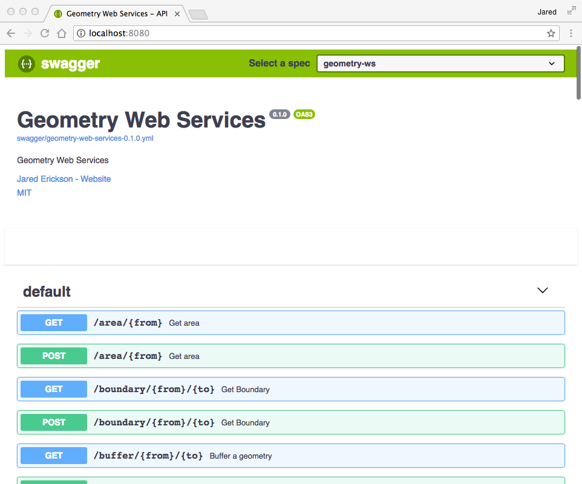
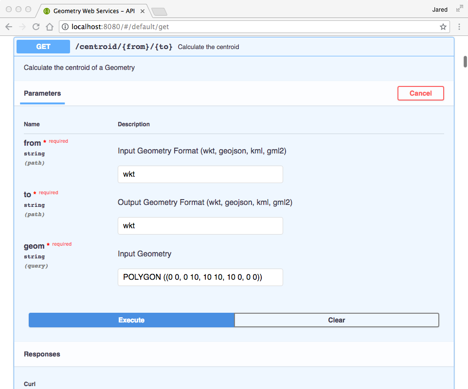
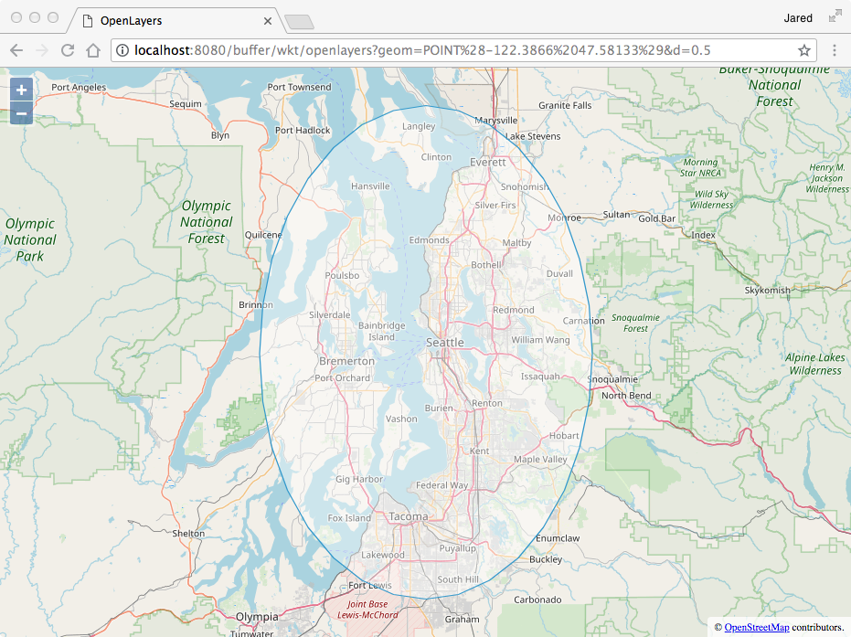

[](https://travis-ci.org/jericks/geometry-ws)

geometry-ws
===========

Micro geometry web services using the Java Topology Suite (JTS) and Micronaut.

Build
-----

```
./gradlew clean build
```

Run
---

```
./gradlew run
```

```
java -jar build/libs/geometry-ws-0.1-all.jar
```

Examples
--------

```
http://localhost:8080/buffer/wkt/wkt?geom=POINT(1 1)&d=10
```

```
http://localhost:8080/buffer/wkt/kml?geom=POINT(1 1)&d=10
```

```
http://localhost:8080/swagger/geometry-web-services-0.0.yml
```

Swagger API documentation is available.



You can use it to try out all of the available web services.



You can visualize result in an OpenLayers or Leaflet map.


